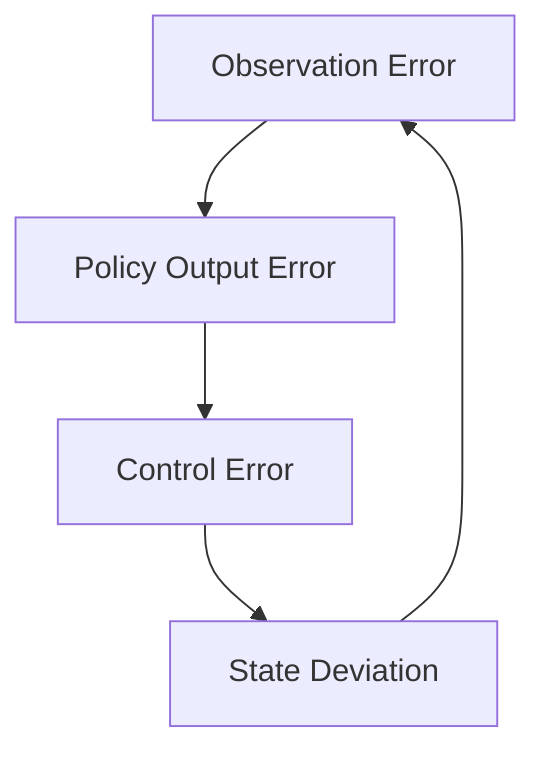

# Sim2Real Theory 

## Overview

Sim2Real (Simulation-to-Reality transfer) describes the process of transferring a control policy trained in simulation to a real robot.

In practice, this process often fails not because of model limitations, but because of **system-level inconsistencies** between simulation and real-world execution.

This section explains the fundamental principles behind Sim2Real, focusing on why failures occur and how to reason about them.

---

## Core Insight

Sim2Real is not primarily a learning problem.

It is a **system consistency problem**.

A policy succeeds only if the following pipeline is consistent:

```
Simulation → Policy → Runtime → Controller → Robot
```

Any mismatch in this chain introduces errors that compound over time.

---

## 1. Sources of Sim2Real Gap

### 1.1 Observation Gap

Differences between simulated and real sensor inputs:

- noise
- delay
- calibration errors
- coordinate frame mismatch

Example:

- IMU in simulation is noise-free
- IMU in real robot has bias and drift

Impact:

- policy receives unexpected input distribution
- leads to unstable behavior

---

### 1.2 Action Gap

Mismatch between intended action and actual execution:

- actuator latency
- motor saturation
- non-linear dynamics

Example:

- simulation assumes instant position update
- real motor has response delay

Impact:

- policy overcompensates
- oscillation or divergence

---

### 1.3 Dynamics Gap

Differences in physical properties:

- mass distribution
- friction
- contact model

Example:

- ground friction differs from simulation
- contact forces are simplified in simulator

Impact:

- unstable locomotion
- incorrect force distribution

---

### 1.4 Timing Gap

Mismatch in execution frequency:

- policy frequency differs from control loop
- irregular scheduling

Impact:

- delayed reactions
- phase mismatch
- instability

---

## 2. Error Propagation

Small mismatches do not remain small.

They propagate through the control loop:



This creates a feedback loop:

- small initial error
- amplified over time
- eventual system failure

---

## 3. Why Simulation Appears Correct

Simulation often hides problems because:

- no sensor noise
- perfect timing
- ideal actuators
- simplified contact models

This creates an **over-idealized environment**.

Policies trained in such environments rely on assumptions that do not hold in reality.

---

## 4. Strategies to Reduce Sim2Real Gap

### 4.1 Domain Randomization

Introduce variability in simulation:

- noise in observations
- variation in mass and friction
- delay injection

Goal:

- force policy to generalize
- reduce reliance on exact conditions

---

### 4.2 System Identification

Adjust simulation parameters to match real robot:

- measure physical parameters
- tune simulation model

Goal:

- reduce modeling error

---

### 4.3 Robust Control Design

Design policies that tolerate error:

- smooth actions
- conservative control
- stability-focused reward

---

### 4.4 Strict Interface Consistency

Ensure:

- joint order identical
- observation format identical
- action mapping identical

This is the most critical engineering constraint.

---

## 5. Practical Interpretation

Sim2Real failures are rarely caused by:

- insufficient model size
- lack of training data

They are usually caused by:

- incorrect assumptions
- mismatched interfaces
- timing inconsistencies

---

## 6. Engineering vs Learning

| Aspect | Learning Focus | Engineering Focus |
|-------|--------------|----------------|
| policy performance | improve reward | ensure consistency |
| generalization | more data | domain randomization |
| deployment | export model | build correct runtime |

Key idea:

> Sim2Real success is determined more by engineering quality than model complexity.

---

## 7. Mental Model

Think of Sim2Real as:

- not transferring a model
- but reproducing an **entire system behavior**

The policy is only one component.

---

## Key Takeaways

- Sim2Real is a system problem, not just a learning problem
- Most failures come from mismatch, not model weakness
- Small inconsistencies amplify over time
- Strict consistency is more important than model complexity
