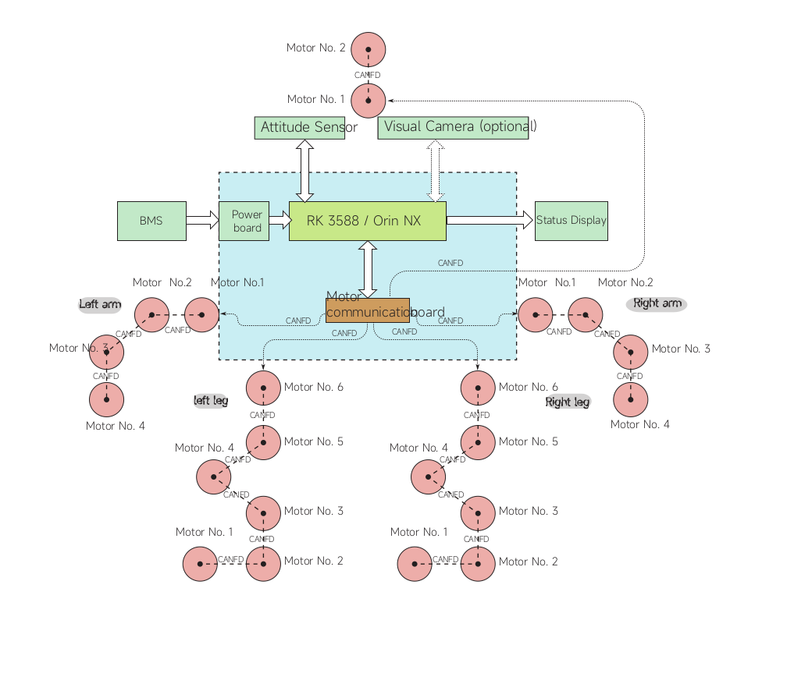

# System Architecture

This section describes the overall system architecture of the platform, including the control stack, software layers, and interaction between components. The system is designed to bridge high-level decision-making and low-level robot execution through a modular and scalable architecture.

---

## Overview

The platform is composed of multiple layers that work together to enable perception, decision-making, and control. At a high level, the system can be divided into:

- High-level decision layer
- Control layer
- Hardware interface layer
- Physical robot system

Each layer is designed to be modular and replaceable.

---

## Layered Architecture

The system follows a layered design to separate concerns and improve maintainability.

### 1. High-Level Layer (Decision / Agent)

This layer is responsible for:

- Task planning
- High-level decision-making
- Policy execution
- Interaction with external systems

It may include:

- AI agents
- Task planners
- Policy inference modules

This layer does not directly control hardware.

---

### 2. Control Layer

The control layer translates high-level commands into executable robot actions. Responsibilities include:

- Motion control
- Joint-level command generation
- State feedback processing
- Real-time control loops

This layer ensures that commands are safe, stable, and physically feasible.

---

### 3. Communication Layer

This layer manages data exchange between modules. It includes:

- ROS2 topics and services
- Message passing mechanisms
- Synchronization across components

The communication layer decouples modules and enables distributed execution.

---

### 4. Hardware Interface Layer

This layer interacts directly with physical hardware. It handles:

- Motor drivers
- Sensor data acquisition
- Low-level communication protocols

This layer abstracts hardware details from upper layers.

---

### 5. Physical Layer

The physical layer includes:

- Robot structure
- Actuators
- Sensors
- Power system

All higher-level logic ultimately affects this layer.

---

## Control Flow

The system operates through a top-down control flow:

1. High-level commands are generated (agent or policy)
2. Commands are translated into control signals
3. Control signals are sent to hardware
4. Sensors provide feedback
5. Feedback is used to update system state

This loop runs continuously during operation.

---

## Data Flow

Data flows in two directions:

### Downstream (Command Flow)
- High-level decisions → control commands → hardware execution

### Upstream (Feedback Flow)
- Sensor data → state estimation → decision updates

This bidirectional flow enables closed-loop control.

---

## Simulation Integration

The architecture supports both simulation and real-world execution. Key design principles:

- Same control interface for simulation and real robot
- Consistent observation and action definitions
- Minimal changes required when switching environments

Simulation is treated as a parallel execution environment.

---

## Sim-to-Real Alignment

To support sim-to-real deployment:

- Interfaces are standardized across environments
- Control pipelines remain consistent
- Differences are handled through robustness (not special cases)

This ensures smooth transition from simulation to hardware.

---

## Modularity

Each layer in the system is designed to be modular. This allows:

- Independent development of components
- Easy replacement or upgrade of modules
- Flexible system configuration

Examples:
- Replace control policy without modifying hardware layer
- Swap simulation backend without changing control logic

---

## Scalability

The system supports scaling in multiple dimensions:

- Multiple robots
- Distributed computation
- Extended sensor systems

The communication layer enables scalable deployment.

---

## Safety Considerations

Safety is enforced across multiple layers:

- Control limits in control layer
- Monitoring mechanisms during runtime
- Emergency stop capability at system level

Safety is not handled by a single component but distributed across the system.

---

## Integration with External Systems

The architecture allows integration with external systems such as:

- AI agent frameworks
- Remote control interfaces
- Data collection pipelines

These systems interact primarily with the high-level layer.

---

## Design Principles

The system is built based on the following principles:

- Separation of concerns
- Interface consistency
- Modularity
- Safety-first design
- Simulation-first development

---

## Summary

The platform architecture connects high-level intelligence with physical execution. By separating decision-making, control, and hardware interaction, the system achieves:

- Flexibility
- Robustness
- Scalability
- Efficient sim-to-real transfer

This architecture forms the foundation of the entire system.

---
