# Get Started

This guide helps you bring up the PI Plus robot from scratch.

By following this page, you will:

- Power on the robot
- Understand hardware interfaces
- Complete zero calibration
- Get the robot ready for operation

---

## 1. Pre-check

Before starting, make sure:

- The robot is placed on a stable and flat surface
- No obstacles are nearby
- Battery is properly installed
- All cables are securely connected

---

## 2. Hardware Overview

Familiarize yourself with the back panel before powering on:

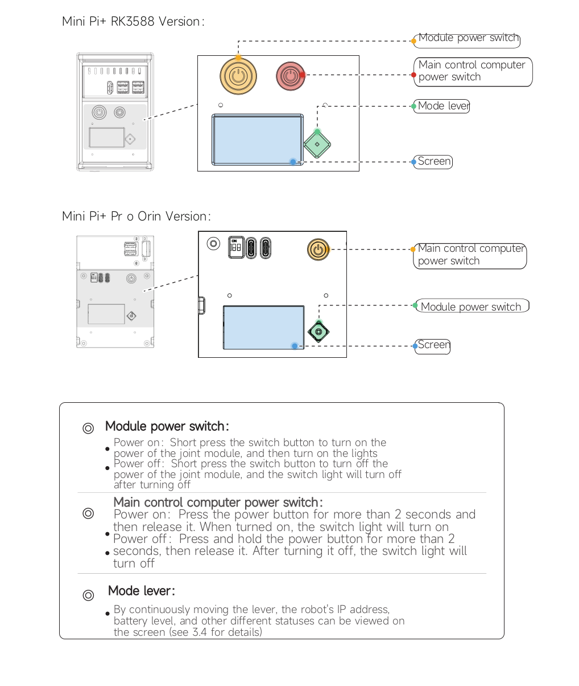

Refer to the status indicators:

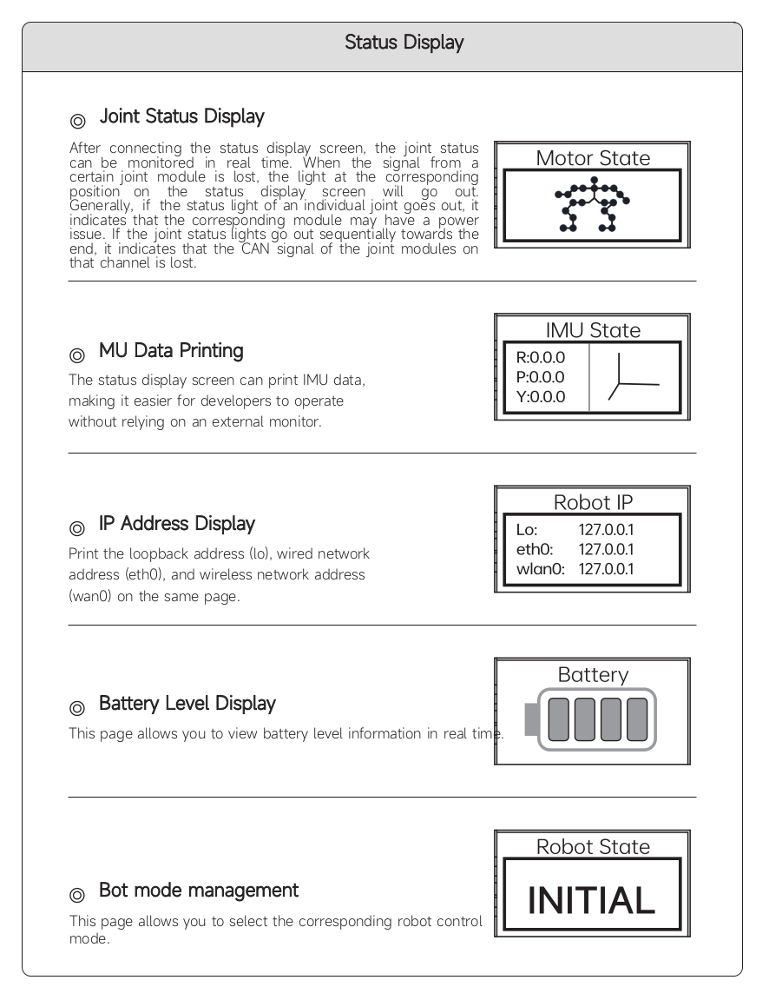

---

## 3. Power On the Robot

Follow the boot process step by step:

### Step 1 – Power On
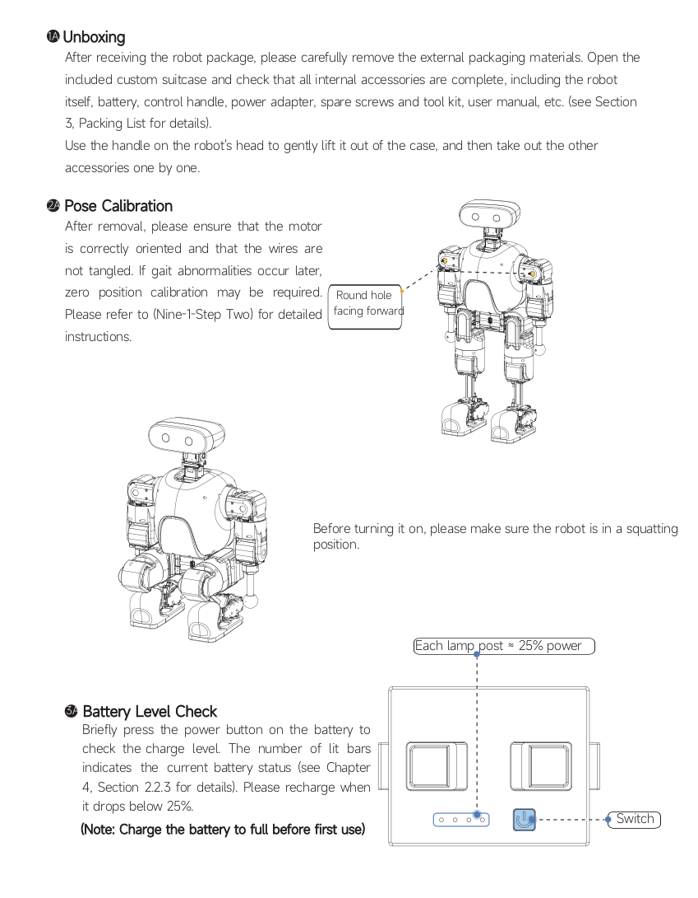

### Step 2 – System Initialization
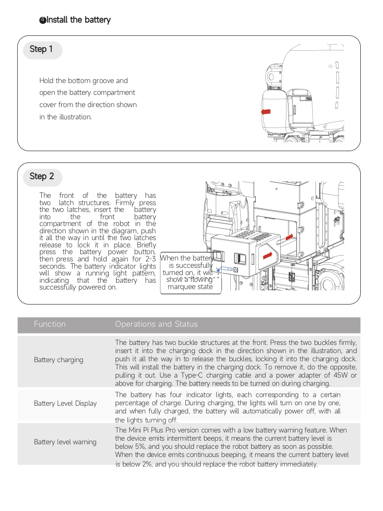

### Step 3 – Controller Ready
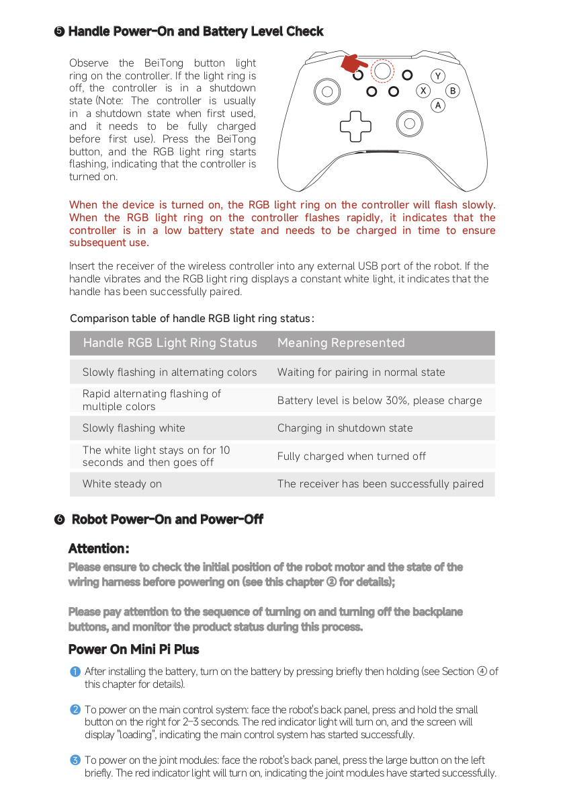

### Step 4 – Robot Ready
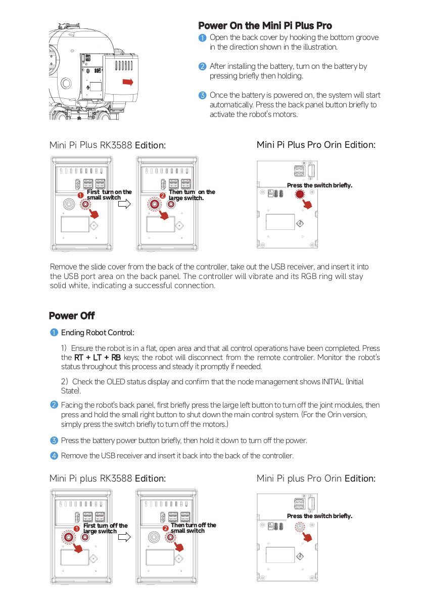

---

## 4. Zero Calibration (Critical)

Before any operation, you must complete zero calibration.

This step ensures all joints are aligned correctly.

### Step 1 – Initial Position
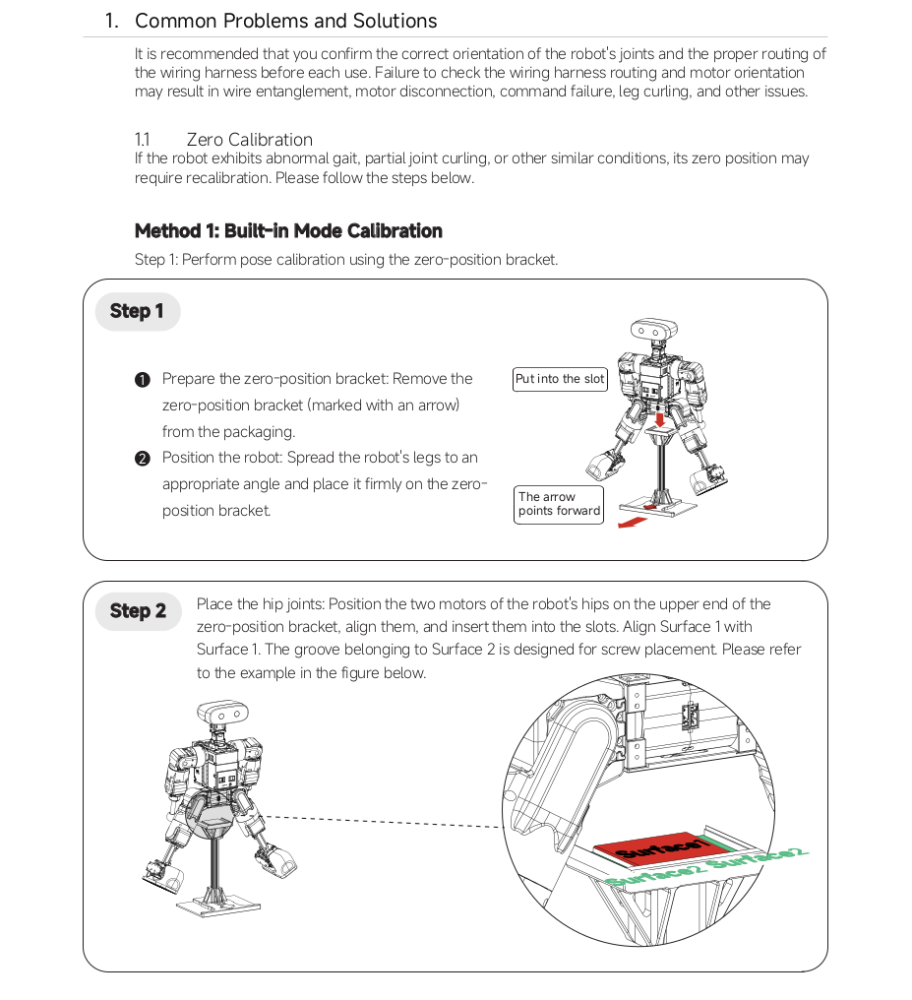

### Step 2
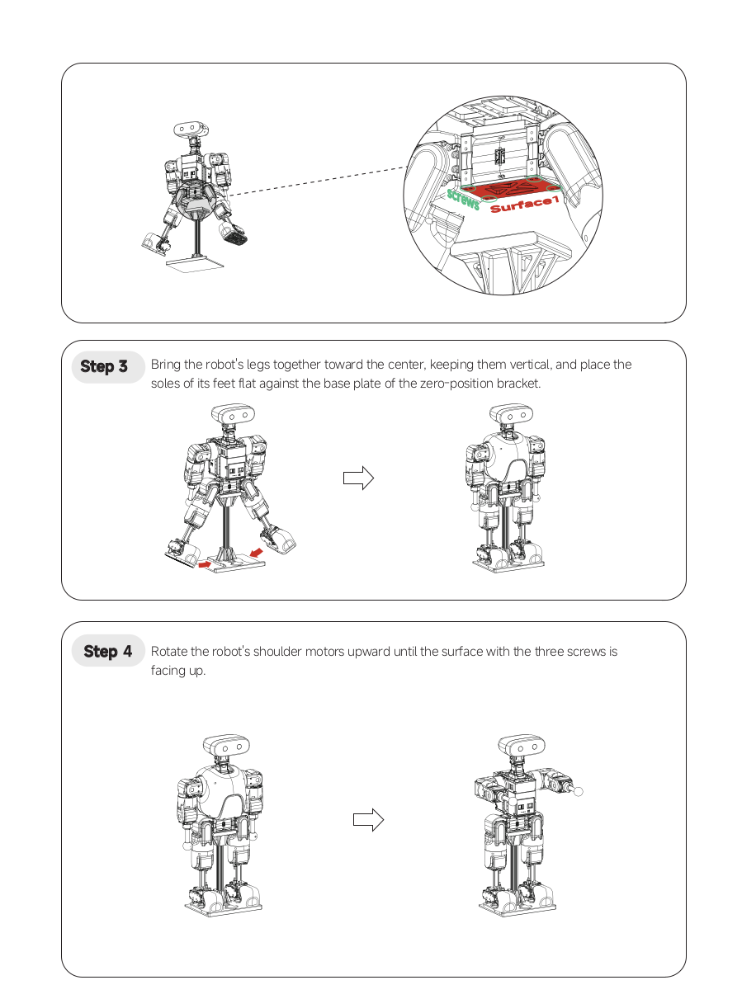

### Step 3
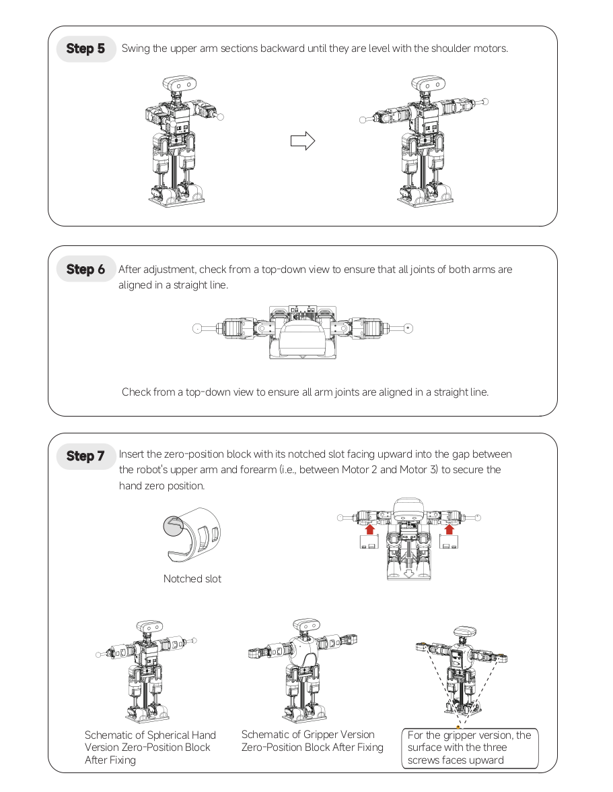

### Step 4
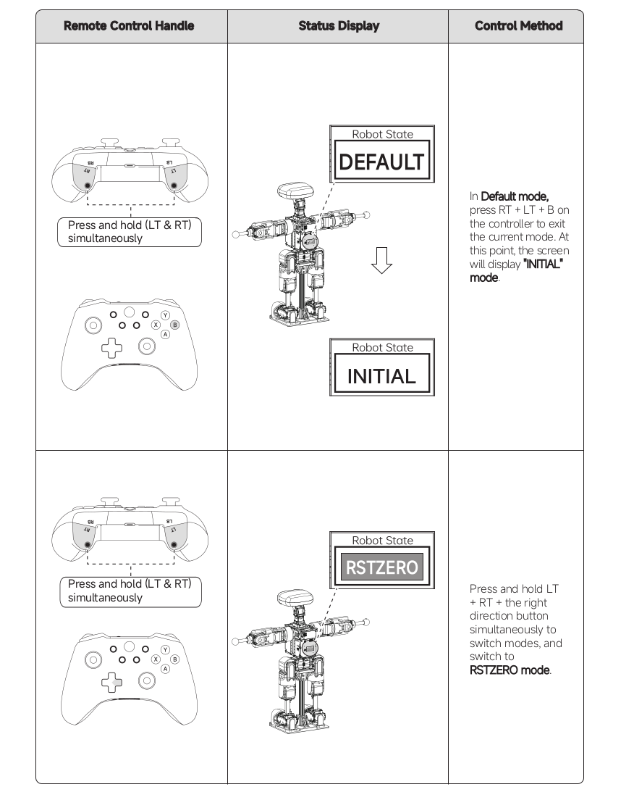

### Step 5
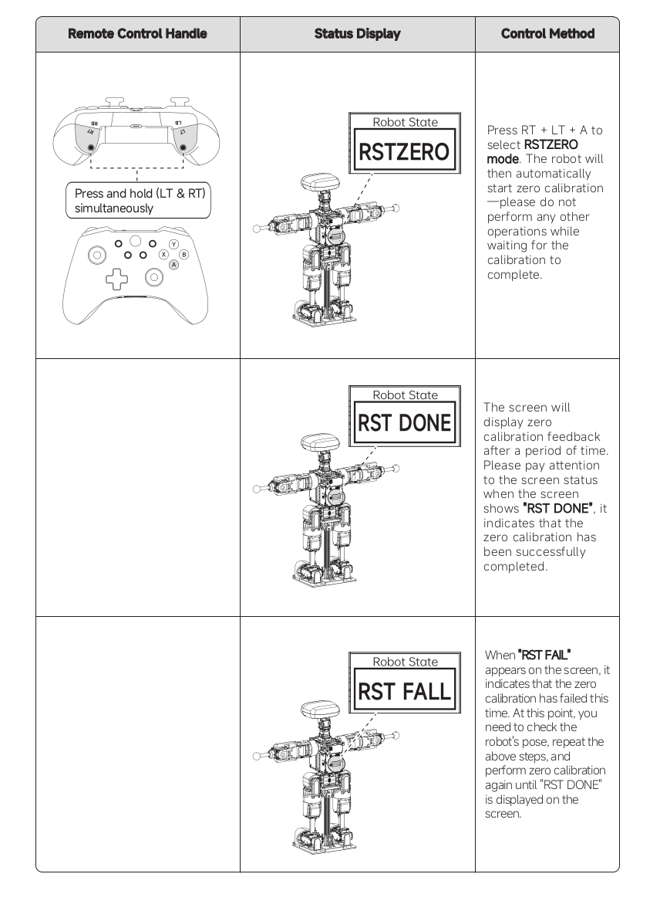

---

## 5. Safety Notice

Before enabling control:

- Ensure the robot is in a safe posture
- Keep distance from moving joints
- Be ready to stop the robot if needed

Refer to posture guidelines:

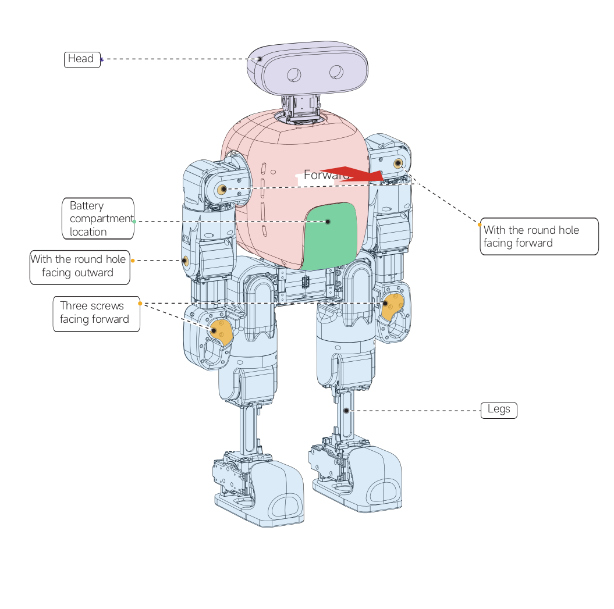

---

## 6. Next Steps

Once the robot is ready:

👉 Continue with:

- [First Run](tutorials/first-run/index.md)
- [Teleoperation](tutorials/safety-and-teleop/index.md)
- [Bringup System](tutorials/bringup/index.md)

---

## Summary

You have completed:

- Hardware check
- Power-on sequence
- Zero calibration

The robot is now ready for operation.
