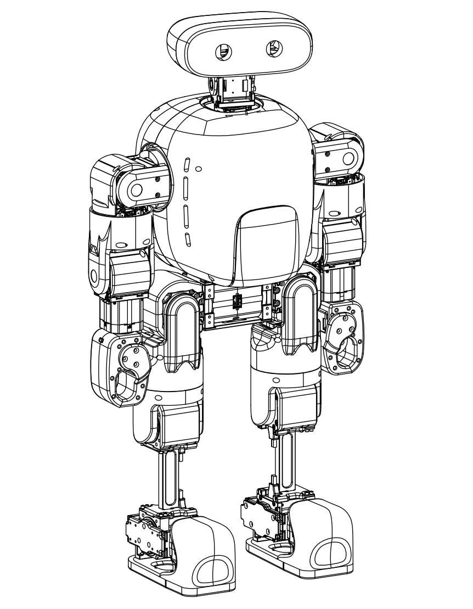
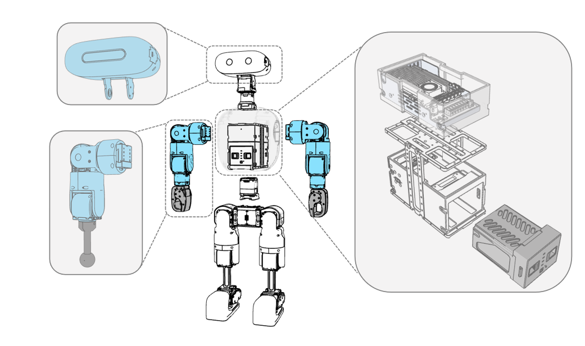
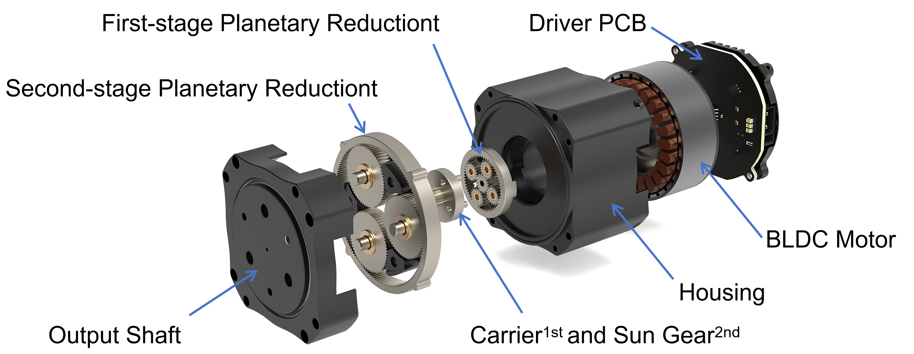
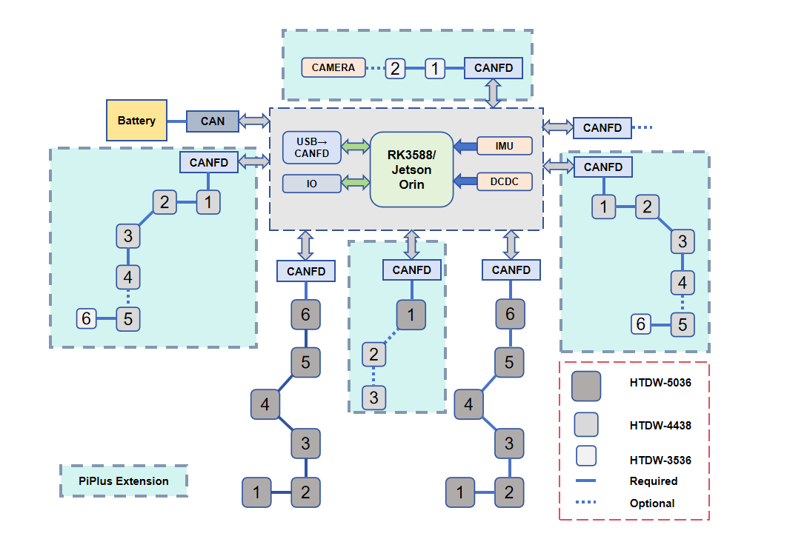
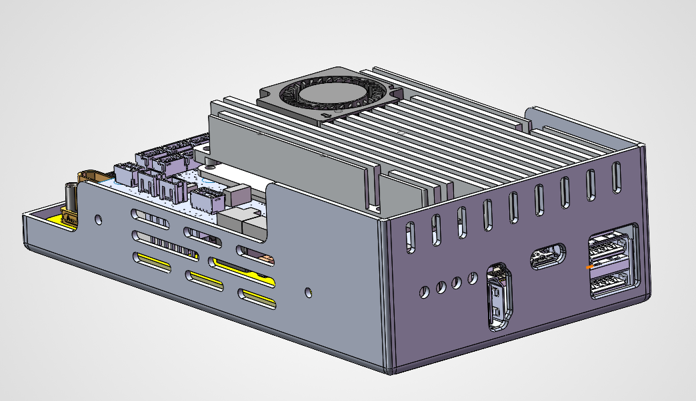
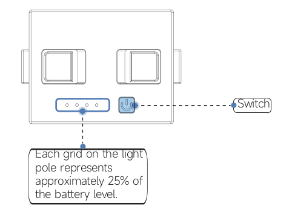

# Hardware

## Overview

Mini Pi+ is a 27-DOF full humanoid robot platform evolved from Mini Pi.

The system follows a modular design:

- Leg modules are fully reused from Mini Pi 
- Upper body (waist, arms, head) is added via quick-release interfaces 
- No modification to leg control strategy or driver layer is required 

This design enables rapid iteration and extensibility.

---

## Mechanical Structure

The robot consists of:

- Legs (fully reused)
- Waist (1 DOF)
- Arms (6 DOF × 2)
- Head (2 DOF)

Key properties:

- Height: ~75 cm 
- Mass: ~13.84 kg 

The modular structure enables rapid hardware extension without redesigning the core system.

---

## Actuation System

The platform uses integrated joint modules:

- HTDW-5036 (legs)
- HTCP-5031 (waist)
- HTDW-4438 (arms)
- HTDW-3536 (arms/head)

Key features:

- Integrated motor, gearbox, driver, and dual encoders 
- Two-stage planetary reduction 
- CAN FD communication (up to 1 kHz control loop) 

Typical performance:

- Leg module peak torque: 21 N·m 
- Arm module peak torque: 10 N·m 
- Head module peak torque: 3 N·m 

---

## System Architecture

The system adopts a distributed control architecture:

- Central controller (RK3588 / Jetson platform) 
- Multi-channel CAN FD communication 
- Independent bus per subsystem 

Each subsystem (legs, arms, waist, head) is connected via isolated CAN FD channels.

---

## Main Control Unit

The main control unit integrates:

- RK3588 computing platform 
- IMU 
- Power management 
- Communication interfaces 

Specifications:

- 16 GB RAM + 128 GB storage 
- Supports motion control, perception, and planning 
- WiFi / Ethernet connectivity 
- OTA update support 

---

## Control Panel

The robot provides a physical control panel for system operation and status monitoring.

### Components

- **Module Power Switch** 
 Controls power to joint modules 

- **Main Control Computer Power Switch** 
 Controls the onboard computing system 

- **Mode Lever** 
 Used to switch display information (e.g., IP address, system status) 

- **Screen** 
 Displays system information and status 

---

### Power Operation

**Module Power**

- Power on: short press → modules powered 
- Power off: short press → modules powered down 

**Main Control Computer**

- Power on: press > 2 seconds 
- Power off: press > 2 seconds 

---

### Status Indication

- The LED bar indicates battery level 
- Each segment represents approximately 25% capacity 

---

### Notes

- Always power on the main control system before sending commands 
- Ensure battery level is sufficient before operation 

---

## Communication Architecture

- 6 independent CAN FD buses 
- Fault isolation between subsystems 
- High-frequency multi-motor coordination 

Advantages:

- Easier debugging 
- Higher reliability 
- Strong scalability 

---

## Power System

### Battery

- 6S lithium battery 
- Nominal voltage: 21.6 V 
- Energy: ~97 Wh 
- Endurance: ~55–65 minutes 

### Power Management

- Multi-branch power distribution 
- Overcurrent / undervoltage / thermal protection 
- Real-time monitoring via CAN 

---

## Sensors and Expansion

### Built-in Sensors

- IMU 
- Joint encoders 

### External Interfaces

- USB 2.0 / 3.0 
- GPIO 
- I²C / SPI / UART 

Supports plug-and-play devices such as:

- Intel RealSense 
- ZED Mini 

---

## System Characteristics

### Modularity

- Quick-release hardware design 
- Upper body can be upgraded independently 

### Reliability

- Multi-bus CAN FD isolation 
- Integrated protection mechanisms 

### Performance

- Verified torque margins 
- Stable thermal performance (< 55 °C in long-duration tests) 

---

## Notes

- Hardware modules are reused across configurations 
- Driver layer remains consistent during upgrades 
