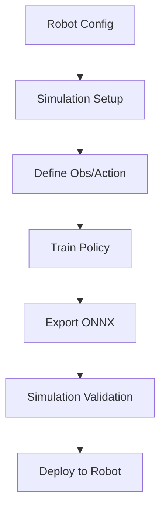

# Simulation Basics 

## Overview

This section explains how to build a reliable simulation pipeline that can be directly transferred to a real robot.

The purpose of simulation is not only to run physics, but to ensure that the **entire control contract** between simulation and real hardware is consistent.

A simulation is considered valid only if the trained policy can be deployed without modification.

---

## Core Requirements

The following elements must remain identical between simulation and real robot:

- Joint order
- Joint limits and direction
- Observation structure
- Action definition
- Control frequency

Violation of any of these will lead to sim-to-real failure.

---

## 1. Robot Definition (Single Source of Truth)

All simulation and deployment must rely on a unified robot definition:

```yaml
robot_type: pi_plus-S-12L8A0G2H0W

required_fields:
  - joint_names
  - lower_limits
  - upper_limits
  - direction
  - urdf_offset
  - kp
  - kd
```

This configuration must be consistent across:

- simulation
- training
- export
- deployment

---

## 2. Simulation Pipelines

Two available approaches:

### PBHC (Legacy Path)

Used in Mini Pi plus baseline:

- Motion retargeting
- Contact labeling
- Motion clipping
- Training in Isaac Gym
- Export ONNX + metadata
- Validate via MuJoCo

This pipeline is stable but complex.

---

### Instinct (Recommended)

A simplified and structured pipeline:

```bash
instinct-train <task_name>
instinct-play <task_name> --export-onnx
```

Outputs:

```
actor.onnx
metadata.json
```

Advantages:

- Clear task abstraction
- Built-in export
- Better scalability

---

## 3. Observation and Action Design

A standard control loop:

```python
obs = concat(
    imu.angular_velocity,
    imu.projected_gravity,
    joint.pos,
    joint.vel,
    last_action,
    command
)

action = policy(obs)

target_q = q_default + scale * action
torque = pd_control(target_q)
```

Key requirement:

- Observation must match real sensor structure
- Action must map correctly to joint space

---

## 4. Critical Validation: Joint Order

Before training or deployment:

```python
assert sim_joint_names == robot_joint_names
```

If incorrect, symptoms include:

- mirrored motion
- wrong limb movement
- instability

This is the most common source of failure.

---

## 5. Sanity Test (Must Run)

Before training or deployment:

1. Set action = 0
2. Run simulation

Verify:

- robot remains stable
- no joint limit violation
- symmetry is preserved

---

## 6. Execution Workflow

A minimal executable pipeline:



---

## 7. Deployment Readiness Checklist

Before moving to real robot:

- ONNX model exported
- Metadata consistent
- Joint order verified
- Control frequency aligned
- Zero-action test passed

---

## 8. Common Issues

| Problem | Cause | Solution |
|--------|------|--------|
| unstable motion | incorrect gains | adjust kp/kd |
| wrong movement | joint mismatch | fix mapping |
| explosion | bad limits | verify config |
| sim works, real fails | timing mismatch | align control loop |

---

## Key Principle

Simulation is not a separate stage.

It is a verification step for deployment.
