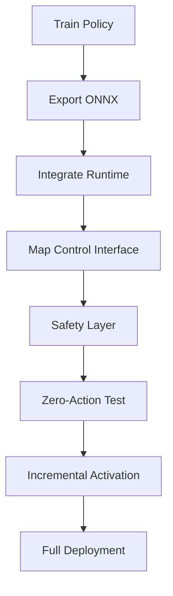

# Sim2Real Deployment 

## Overview

This section describes how to deploy a trained policy from simulation to a real robot.

The objective is to ensure that a policy trained in simulation can be executed on real hardware **without modifying its structure or semantics**.

This process includes:

- Model export
- Runtime integration
- Control loop alignment
- Safety validation
- Real-world debugging

---

## Core Principle

Sim2Real is not a conversion step.

It is a **consistency verification process** between:

- simulation pipeline
- deployment pipeline

A successful deployment requires that both pipelines share:

- identical observation structure
- identical action interpretation
- identical timing behavior

---

## 1. Model Export

After training, export the policy:

```bash
instinct-play <task_name> --export-onnx
```

Output:

```
actor.onnx
metadata.json
```

### Requirements

- ONNX graph must be static and deterministic
- Input/output tensor shapes must match deployment runtime
- Metadata must define:
  - observation order
  - action scaling
  - default joint pose

---

## 2. Runtime Integration

The deployed model must be integrated into a runtime system:

Typical stack:

```
Sensor → Observation Builder → Policy (ONNX) → Action Decoder → Controller → Robot
```

### Minimal Inference Loop

```python
obs = build_observation(sensor_data)
action = onnx_model.run(obs)
target_q = decode_action(action)
send_to_controller(target_q)
```

---

## 3. Control Interface Mapping

The policy output must be mapped to the robot control interface.

Typical mapping:

```python
target_q = q_default + scale * action
torque = pd_control(target_q, current_q, current_dq)
```

Requirements:

- Joint order must match exactly
- Scaling must match training configuration
- Controller gains must be consistent

---

## 4. Control Frequency Alignment

Simulation and real robot must run at compatible frequencies.

Example:

| Component | Frequency |
|----------|----------|
| Policy | 50 Hz |
| Controller | 500 Hz |

Implementation:

- policy runs at low frequency
- controller interpolates or holds command

Mismatch leads to:

- delayed response
- oscillation
- instability

---

## 5. Safety Layer (Mandatory)

Before enabling full control, implement safety constraints:

### Joint Limits

```python
target_q = clip(target_q, lower_limits, upper_limits)
```

### Torque Limits

```python
torque = clip(torque, -tau_limit, tau_limit)
```

### Emergency Stop

- hardware-level stop
- software watchdog timeout

---

## 6. Zero-Action Validation

Before running policy:

1. Set action = 0
2. Run system

Expected:

- robot remains stable
- no drift
- no oscillation

If failure occurs:

- check joint direction
- check default pose
- check controller gains

---

## 7. Incremental Activation Strategy

Do not directly run full policy.

Recommended steps:

1. Zero-action test
2. Small amplitude action test
3. Single-joint test
4. Full policy rollout

---

## 8. Real-World Debugging

Common debugging steps:

### Step 1: Verify Observation

- check sensor values
- compare with simulation range

### Step 2: Verify Action

- log raw policy output
- ensure values are bounded

### Step 3: Verify Mapping

- confirm action → joint mapping
- check sign and scaling

### Step 4: Verify Timing

- measure loop frequency
- ensure stable scheduling

---

## 9. Common Failures

| Problem | Cause | Solution |
|--------|------|--------|
| unstable robot | wrong gains | tune kp/kd |
| wrong movement | joint mismatch | fix mapping |
| oscillation | timing mismatch | align frequency |
| no response | inference failure | check ONNX runtime |
| drift at zero | offset error | fix default pose |

---

## 10. Execution Workflow



---

## Key Takeaways

- Sim2Real depends on strict consistency
- Most failures come from mismatch, not model quality
- Always validate step-by-step
- Never skip safety checks
